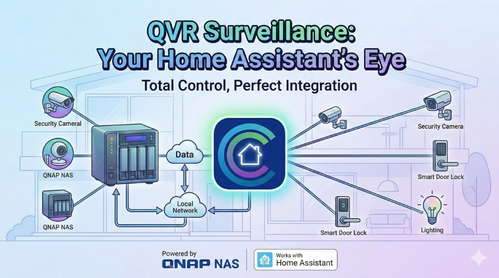

# QVR Surveillance



QVR Pro / QVR Elite / QVR Surveillance (QNAP) integration for Home Assistant. **Standalone** – no pyqvrpro dependency.

**Important:** QNAP QVR Surveillance requires a QVR server application compliant with **API 1.3.1 minimum**.

**Maintainer:** Mariusz Grzybacz, Silas ([[-__-][) qnapclub.pl, 2026.03.01

## Installation (HACS)

1. In HACS: **Settings** → **Integrations** → **Add** (➕) → **Custom repositories**
2. Add: `https://github.com/silasmariusz/qvr-surveillance-ha` | Category: **Integration**
3. Click **Add**
4. Go to **Integrations**, search for **QVR Surveillance**, install
5. Restart Home Assistant

Or use [this My Home Assistant link](https://my.home-assistant.io/redirect/hacs_repository/?owner=silasmariusz&repository=qvr-surveillance-ha&category=integration) (requires [My Home Assistant](https://my.home-assistant.io/)).

**Manual install:** Copy the `custom_components/qvr_surveillance` folder to your Home Assistant `custom_components` directory.

## Configuration

```yaml
qvr_surveillance:
  host: 10.100.200.10
  username: admin
  password: "your_password"
  use_ssl: false
  port: 8080
  client_id: qvr_surveillance
  event_scan_interval: 60  # optional, 15–300 s, IVA binary_sensor polling
```

Default ports: 8080 (HTTP), 443 (HTTPS). **QVR Surveillance** (standalone NVR) uses port **38080**.

- `add_substream` (optional, default `true`): creates a second entity per channel for Sub stream – enables substream switch in Advanced Camera Card.
- `stream_index` (optional, legacy): 0=Main, 1=Substream, 2=Mobile. Ignored when `add_substream: true` (both Main and Sub entities are created).

## Services

| Service | Description |
|---------|-------------|
| `qvr_surveillance.start_recording` | Start recording (guid, entity_id, or channel_index) |
| `qvr_surveillance.stop_recording` | Stop recording (guid, entity_id, or channel_index) |
| `qvr_surveillance.ptz_control` | PTZ (guid/entity_id/channel_index, action_id, direction) |
| `qvr_surveillance.reconnect` | Force reconnection (re-authenticate) |

## WebSocket API

| Type | Description |
|------|-------------|
| `qvr_surveillance/recordings/summary` | Recording summary (instance_id, camera, timezone) |
| `qvr_surveillance/recordings/get` | Recording segments (instance_id, camera, after, before) |
| `qvr_surveillance/events/get` | Surveillance events (camera, start, max_results, event_type) |
| `qvr_surveillance/events/summary` | Filter metadata (event_types, cameras) |
| `qvr_surveillance/logs/get` | QVR Pro logs (log_type, level, start, max_results, etc.) |

## Event types (IVA / Alarm)

Events support these QVR IVA and Alarm Input types (from logs/metadata):

- `alarm_input` – Alarm input trigger
- `iva_crossline_manual` – Cross-line (manual)
- `iva_audio_detected_manual` – Audio detection (manual)
- `iva_tampering_detected_manual` – Tampering detection (manual)
- `iva_intrusion_detected` – Intrusion detection
- `iva_intrusion_detected_manual` – Intrusion detection (manual)
- `iva_digital_autotrack_manual` – Digital autotrack (manual)

Event type is taken from `metadata.event_name`, `type`, `event_type`, or from the message content. Use `event_type` in `events/get` to filter.

### IVA binary sensors

Integration creates **binary sensors** for each camera – one per channel, state `on` when any IVA/Alarm event occurred in the last N seconds. Configurable via `event_scan_interval` (15–300 s, default 60). Attributes: `last_event_type`, `last_event_time`, `last_message`. Use in automations for motion/alarm triggers.

## Przeglądanie nagrań / Browse recordings

### 1. Media app (Panel mediów)

1. Otwórz **Panel mediów** (Media) w Home Assistant
2. Wybierz **QVR Surveillance** jako źródło
3. Przeglądaj: Kamery → Dni (ostatnie 7) → Godziny (0–23)
4. Odtwórz wybraną godzinę

### 2. Advanced Camera Card (timeline)

1. Skonfiguruj kamerę z `engine: qvr_surveillance`
2. Włącz timeline w karcie
3. Timeline pokazuje syntetyczne segmenty (24/7) – odtwarzanie przez proxy
4. **Zdarzenia** (eventy z `qvr_surveillance/events/get`) są wyświetlane na osi czasu – miniatury używają snapshotu na żywo z kamery (jak w browse)

### 3. Konfiguracja

Brak dodatkowej konfiguracji – media source jest zarejestrowany automatycznie po dodaniu integracji. Nagrania są pobierane z QVR Pro przez proxy `/api/qvr_surveillance/{client_id}/recording/...`.

**Uwaga:** QVR Pro API nie udostępnia listy nagrań po dacie – browse zakłada typowy scenariusz 24/7 (ostatnie 7 dni). Miniatury: snapshot na żywo z kamery.

**Odtwarzanie (502):** Integracja próbuje wielu wariantów API (`/qvrpro/`, `/qvrsurveillance/camera/recordingfile/`, parametry time/start/end). Przy 502 włącz debug: `logger: custom_components.qvr_surveillance: debug` i sprawdź logi – wskażą, czy problem jest w wywołaniu API QVR, czy w pobieraniu URL zwróconego przez QVR. QVR Surveillance (standalone) może nie wspierać `/camera/recordingfile/` – wówczas odtwarzanie nagrań nie będzie dostępne.

**Test symulacji:** `python test_recording_playback.py` (wymaga `QVR_PASS`, opcjonalnie `QVR_HOST`, `QVR_PORT`, `QVR_DATE=2026-03-02`) – sprawdza pełny przepływ API→pobranie→zapis pliku.

**Ikona w Media Browserze:** Przy „icon not available” dodaj ikonę przez PR do [home-assistant/brands](https://github.com/home-assistant/brands) – instrukcja w `brands_pr/README.md`.

### Troubleshooting "Brak elementów"

Jeśli Media pokazuje pustą listę:
1. Upewnij się, że integracja ładuje się poprawnie (kamery QVR w HA).
2. Włącz debug: `logger: default: warning, custom_components.qvr_surveillance: debug`
3. Po otwarciu Media sprawdź logi – klucze odpowiedzi API pomogą zdiagnozować format QVR.

### Troubleshooting: Camera 500, Recording 404, HTTP warning

- **Camera 500 (Internal Server Error):** Snapshot może zawodzić przy wolnej odpowiedzi QVR. Integracja obsługuje `async_camera_image`, retry po błędzie auth i zwraca `None` zamiast pustych bajtów. Sprawdź logi: `[QVR] ... | cmd=get_snapshot`.
- **Recording 404:** Brak nagrania w danym przedziale czasowym lub QVR Surveillance nie obsługuje API `/camera/recordingfile/`. Włącz debug i sprawdź logi.
- **"Loaded over insecure connection" (HTTP):** Przy dostępie do HA przez `http://` (np. lokalny IP) przeglądarka ostrzeże przed HTTP. Zalecane: skonfiguruj HTTPS (np. Nabu Casa, reverse proxy z Let's Encrypt) – szczególnie przy zdalnym dostępie.

## Advanced Camera Card

Add cameras by **camera entity** (e.g. `camera.qvr_surveillance_1`). The card auto-detects the QVR engine from the entity platform. For events on the timeline, ensure:
- Integration exposes `qvr_guid` and `qvr_client_id` (from v1.6.1) in camera attributes
- Card uses timeline view with snapshots/recordings capability

### Substream switch (Main / Sub)

With `add_substream: true` (default), each channel gets two entities: Main (stream 0) and Sub (stream 1). To enable the substream switch button in the card, link them via `dependencies`:

```yaml
cameras:
  - camera_entity: camera.qvr_surveillance_channel_1      # Main
    dependencies:
      cameras: [camera.qvr_surveillance_channel_1_sub]   # Sub entity
  - camera_entity: camera.qvr_surveillance_channel_1_sub  # Sub (optional – only if you want Sub as primary)
```

User can then toggle Main/Sub via the substream button (mdi:video-input-component) in live view.

Optional explicit config:
```yaml
cameras:
  - camera_entity: camera.qvr_surveillance_1
    engine: qvr_surveillance
    qvr_surveillance:
      client_id: qvr_surveillance  # match integration config
      channel_guid: AECCAF...      # optional, auto from entity
```
