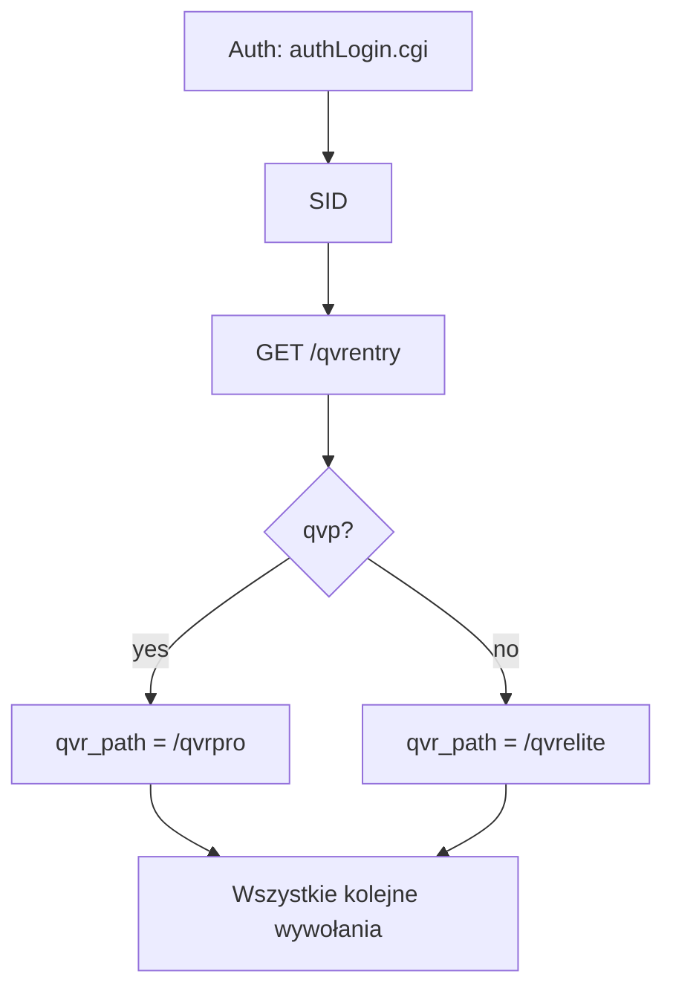
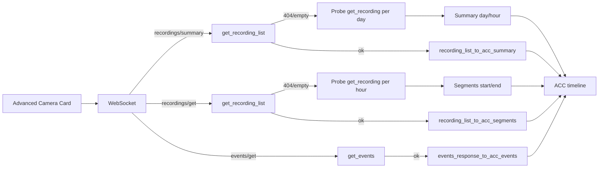
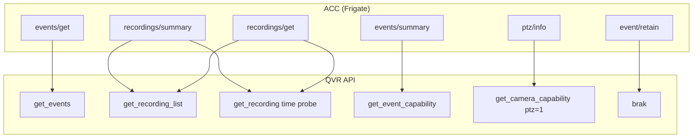

# QVR API – Infografika (schematy, przepływy)

Input do infografiki. Mermaid – renderuj w GitHub/Markdown viewer.

---

## 1. Przepływ: Od czego zacząć



---

## 2. Przepływ: Timeline dla ACC



---

## 3. Drzewo endpointów

```mermaid
flowchart TB
    ROOT[QVR API]
    ROOT --> QVRE[/qvrentry]
    ROOT --> QVR["{qvr_path}"]
    
    QVR --> QSHARE["/qshare"]
    QVR --> CAM["/camera"]
    QVR --> LOGS["/logs"]
    QVR --> PTZ["/ptz"]
    
    QSHARE --> CH["StreamingOutput/channels"]
    QSHARE --> STR["channel/{guid}/streams"]
    QSHARE --> LIVE["stream/{n}/liveStream POST"]
    
    CAM --> SNAP["snapshot/{guid}"]
    CAM --> REC["recordingfile/{guid}/{ch}"]
    CAM --> RECLIST["recording/{guid}"]
    CAM --> LIST["list"]
    CAM --> CAP["capability"]
    CAM --> SEARCH["search"]
    CAM --> EV["events"]
    CAM --> MREC["mrec/{guid}/start|stop PUT"]
    
    CAP --> |ptz=0,1| CAP_PTZ
    CAP --> |act=get_event_capability| CAP_EV
    CAP --> |act=get_camera_capability| CAP_CAM
    
    LOGS --> LOGS_T["logs?log_type=1..5"]
```

---

## 4. Co ACC potrzebuje vs co QVR daje



---

## 5. Tabela: Cel → Zapytanie

| Cel | Pierwsze zapytanie | Fallback (gdy 404) |
|-----|-------------------|---------------------|
| Lista kanałów | get_channels | – |
| Stream na żywo | get_live_stream | – |
| Migawka | get_snapshot | – |
| Nagranie (playback) | get_recording(time) | – |
| Segmenty timeline | get_recording_list(guid, start, end) | Probe get_recording co 1h |
| Summary timeline | get_recording_list(guid) | Probe get_recording raz/dzień |
| Eventy timeline | get_events | – ([] gdy 404) |
| PTZ presety | get_camera_capability(ptz=1) | – |
| Typy IVA | get_event_capability | – |
| Logi (sensory HA) | get_logs | – |
